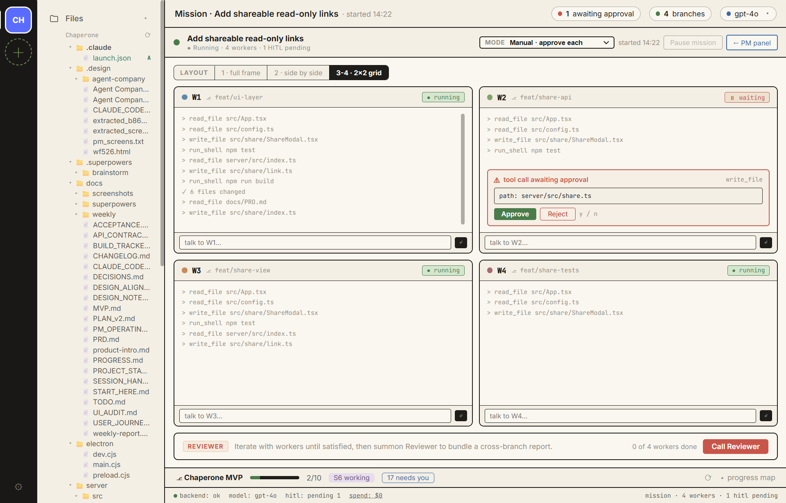
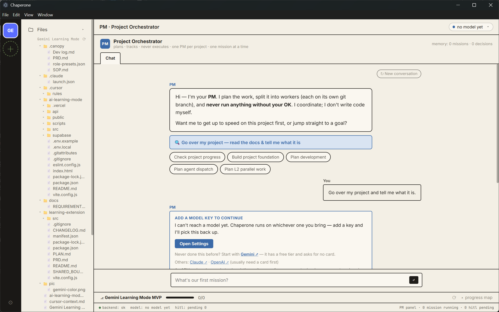
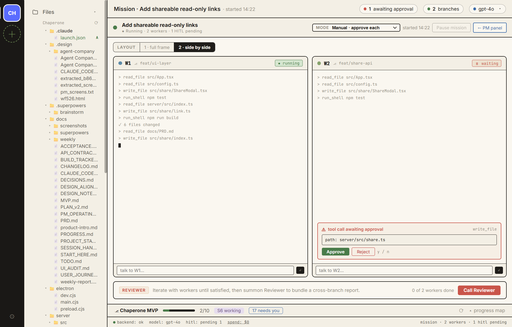
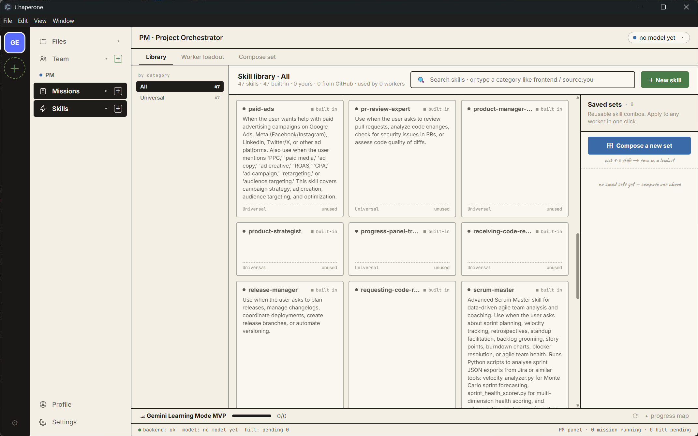
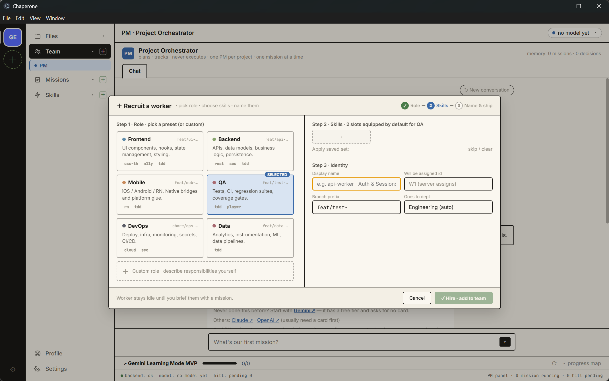
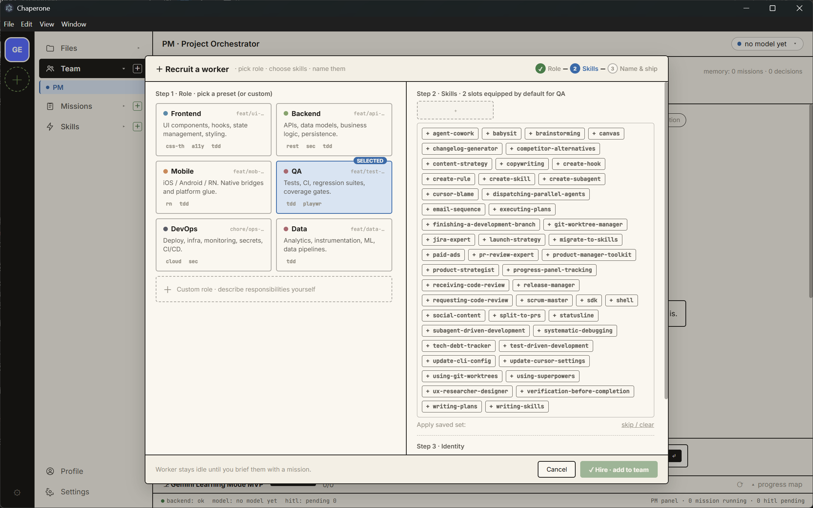
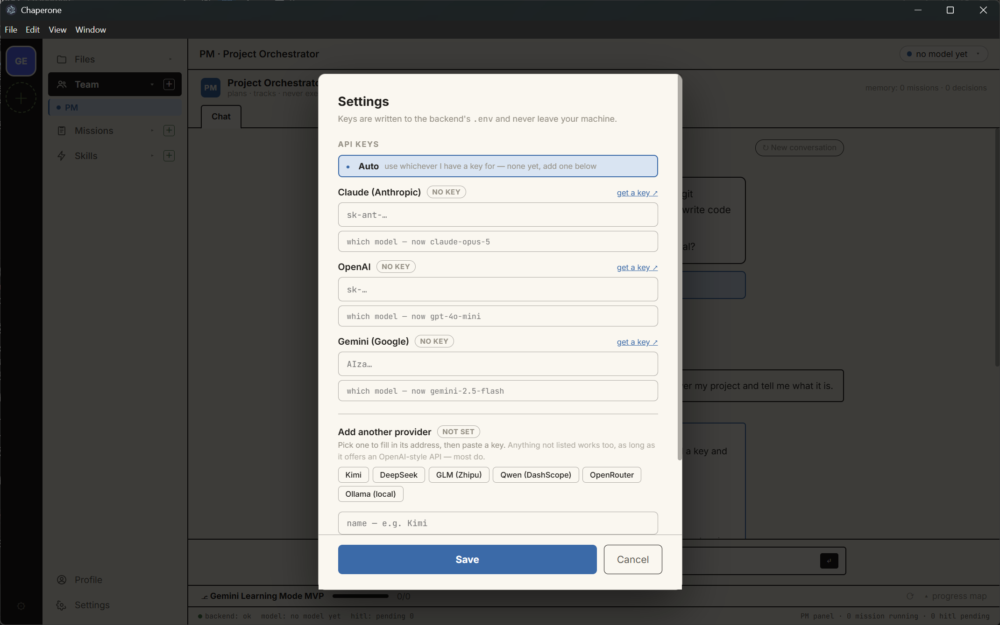
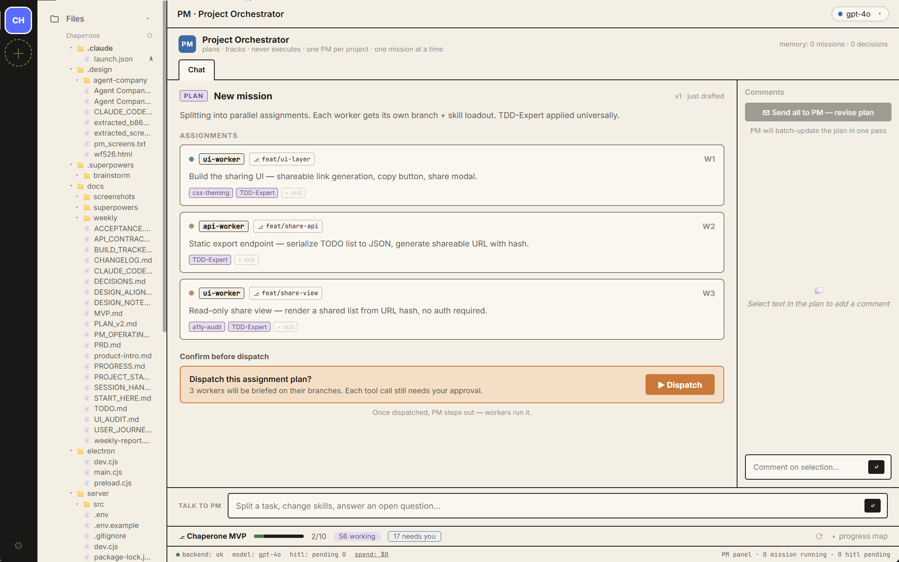

# Chaperone

**A visible harness for building software with AI.**

Most AI coding tools are a chat box in front of a black box: you type, something
happens, code appears, and you find out later whether it was the right code. The
work is invisible while it happens and unaccountable after.

Chaperone turns that into a process you can see and steer. You **staff a team** —
hire agents into roles, equip each with a limited set of skills. You **watch them
work**, each in its own pane, on its own git branch, and you can talk to any one of
them mid-task. **By default a worker stops and holds any write until you approve
it**; you can loosen that to auto-approve reads, or let it run a whole task — even
then it stops before the merge. A reviewer reads the diffs. And the project's
progress lives in a file the model cannot talk its way around.

The effect is that your project gets run the way a real engineering team would run
it — a spec written down before the building starts, conventions kept on disk, work
split into slices that can actually ship, and nothing counted as done because an
agent said so. You get that whether or not you know those practices have names.

It's for people who know what they want built but don't write the code themselves.

### What makes it different

| | |
| --- | --- |
| **Hire, don't prompt** | Agents are staffed into roles (frontend, backend, QA, DevOps, data) with a branch prefix and a skill loadout — not conjured per message. |
| **Skills are equipment** | A skill library you can search and compose into reusable sets, then equip into a worker's limited slots. Arming an agent is a deliberate, visible act, not a hidden config file. |
| **Sub-tasks aren't a black box** | Every worker gets its own pane showing its real tool calls as they happen. You can interrupt any one of them — "switch to Zustand", "explain that file" — without stopping the others. |
| **Isolation by construction** | One worker, one git branch. Parallel work can't collide, and a bad run is a branch you don't merge. |
| **Approval is the default, not the ceiling** | Out of the box a worker holds every write for you. Three settings: ask every time · auto-approve reads · run the whole task. The loosest one still stops before the merge. |
| **The process comes with it** | The PM writes the spec before building starts, keeps the project's conventions on disk, and splits work into slices that can ship. Standard practice on a professional team; unknown to most people who have never been on one. |
| **Progress you can trust** | A board of vertical slices with their acceptance items, read from `.chaperone/progress.json` — done / working / needs you / blocked. Structured state on disk, not the model's account of itself in chat. |
| **Parallelism has a gearbox** | How many agents may write at once is derived, not guessed: while the foundation is still moving you get read-only audits; only once it settles does the PM propose widening. Raising the gear needs your confirmation, lowering it doesn't. |
| **Any model, your key** | Claude, OpenAI, Gemini, or anything OpenAI-compatible — Kimi, DeepSeek, GLM, Qwen, a local Ollama. You pay the provider; the running cost is on screen as it accrues. |

> **Status: early and opinionated.** The core loop — PM reads the project, workers
> run on branches, you approve, reviewer reads the diffs — works today. Parts of the
> UI are still drawn but not wired, and [docs/UI_AUDIT.md](docs/UI_AUDIT.md) lists
> exactly which.



*Four workers on four branches. W2 has stopped mid-task and is holding a `write_file` call until you approve it — nothing touches your repo before you say so.*

---

## What it looks like

<table>
<tr>
<td width="50%">

**The PM reads your project first**



It calls read-only tools and reports what it actually found — the files listed are the ones it opened.

</td>
<td width="50%">

**Two workers, side by side**



Layout follows the worker count: one fills the frame, two split it, three or four take a 2×2.

</td>
</tr>
<tr>
<td width="50%">

**Skills are equipped, not configured**



Read from your own skills directory. Search, categorise, and save reusable sets.

</td>
<td width="50%">

**Hiring a worker takes three steps**



Pick a role, equip skills, name it. The branch prefix is derived from the role.

</td>
</tr>
<tr>
<td width="50%">

**Loadouts per worker**



Limited slots, on purpose: arming an agent should be a visible decision.

</td>
<td width="50%">

**Bring your own model**



Claude, OpenAI, Gemini, or anything with an OpenAI-style API — Kimi, DeepSeek, GLM, Qwen, a local Ollama.

</td>
</tr>
</table>

> **On these screenshots.** The PM scan, skill library, recruiting and settings are
> live screens with real data. The mission frames use a sample mission: the
> orchestration UI, approval gates and layout are the real components, but no
> models were run to produce them. The mission plan screen below is a design
> preview whose content is still hardcoded — see
> [docs/UI_AUDIT.md](docs/UI_AUDIT.md), which lists everything in the app that is
> drawn but not yet wired.

<details>
<summary>Mission plan (design preview — content not yet wired)</summary>



</details>

---

## What it's for

AI goes wrong in the same handful of ways every time: it loses the thread across
several features at once, rewrites something that already worked, reports success it
did not achieve, or burns an hour of tokens with nothing to show. A developer
catches these by instinct. Someone without that instinct finds out much later, when
the project is already tangled.

Catching them is what the structure here is for — the checkpoints, the one-worker-
one-branch isolation, the reviewer, the board that only you can mark accepted.

## The progress board

The part with no obvious equivalent elsewhere. Work is tracked as **vertical
slices** — S1, S2, S3 — each with the acceptance items that make it real, and each
carrying a status that rolls up:

```
CEO briefs a goal → PM plans → Workers build on branches → CEO reviews & merges
                                              gear L1   ·   volatility High

S1 · PM produces a real plan                                          done
S2 · PM dispatches read-only L1 audits                           needs you
S3 · Worker edits a real file on a branch                        needs you
      git branch create/checkout                                 needs you
      worker write_file (HITL-gated) + auto-commit to branch      needs you
      /api/diff — CEO sees the real committed diff               needs you
```

Two things make this different from a task list:

**It is read from disk, not from the conversation.** The board comes from
`.chaperone/progress.json`. An agent that says it finished something has not
changed the board; acceptance does. "Needs you" is a real queue, not a summary.

**The gearbox is on it.** `gear L1 · volatility High` is the tool's answer to the
question that sinks parallel agent work: *how many can safely write at once?* It is
derived from how often recent work touched the project's foundation files —

| Gear | Foundation | What may run in parallel |
| --- | --- | --- |
| **L1** | unknown or being mapped | reads only — audits |
| **L2** | being built, one active slice | limited concurrent writes, within one slice, by layer |
| **L3** | frozen | concurrent writes across slices |

Widening needs your explicit confirmation; narrowing happens automatically and gets
logged with its reason. The full model is in
[docs/PM_OPERATING_MODEL.md](docs/PM_OPERATING_MODEL.md).

## Quick start

```bash
git clone https://github.com/LinzhiW/chaperone.git
cd chaperone
npm install && cd server && npm install && cd ..
npm run desktop
```

That builds both halves and opens the desktop app. Add a model key under Settings —
[Gemini](https://aistudio.google.com/apikey) has a free tier and asks for no card,
which is the shortest path to seeing it work. You pay the provider directly;
Chaperone never sees your bill or your key.

Running from source, packaging an installer, where credentials are stored, and the
proxy note: **[docs/SETUP.md](docs/SETUP.md)**.

## How it's laid out

```
src/                 React + Vite frontend
  App.tsx            main shell — onboarding, PM chat, mission dashboard, reviewer
  skills/            skill library, import, loadout, compose-set
  recruit/           worker recruiting + role presets
  chaperoneTypes.ts  shared types (team / skills / loadouts / saved sets)
server/
  src/index.ts       Express API — mission execution, PM chat, reviewer, git ops
  src/persistence.ts JSON persistence under <project>/.chaperone/
docs/                PRD, project state, decisions, operating model
```

**Per-project data.** Chaperone writes its state into a `.chaperone/` folder inside
*the project you point it at* — plan, progress, role presets. Your code stays yours;
Chaperone only adds that one folder.

---

## Contributing

Issues and discussion are very welcome. Before sending code, please read
[CONTRIBUTING.md](CONTRIBUTING.md) — contributions require signing a Contributor
License Agreement.

## License

[GNU AGPL-3.0](LICENSE).

In plain terms: you can run, study, modify, and share this freely. If you run a
modified version as a network service, you have to publish your changes too.

If the AGPL doesn't work for your situation, a separate commercial license is
available — open an issue or get in touch.
